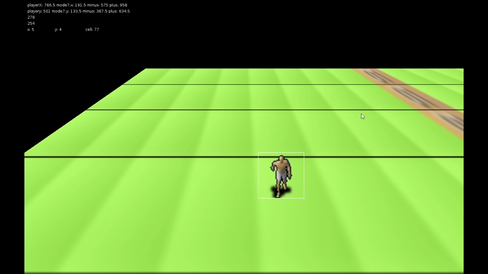

# legacy-lua-mode7
##### _Mode 7_

## About
**Mode 7** is a retro-style perspective-rendering experiment built with Lua and [LOVE2D](https://love2d.org), originally written around 2011. Pseudo-3D floor rendering with real-time rotation and scaling.

## Features
- Mode 7 perspective transformation on a 2D tile plane
- Real-time camera rotation and zoom
- Texture-mapped floor rendering from tile grids
- Sprite animation framework (AnAL.lua)
- Web build via love.js (WASM)

### Links

    
     
    <strong>Play:</strong>
     
    
    
     
    <strong>Source Code:</strong>
     
    
     
    

## Video

Click to play

## Running locally

    npm run setup      # install npm deps + download LOVE 11.5
    npm start          # launch the game

### Web build

    npm run build      # pack src/ into .love, compile to Web/ via love.js
    npm run serve      # serve Web/ at http://localhost:8080

## Documentation

See the [docs](docs/index.md) for how the rendering works.

## License

MIT License. See `LICENSE` file for details.
